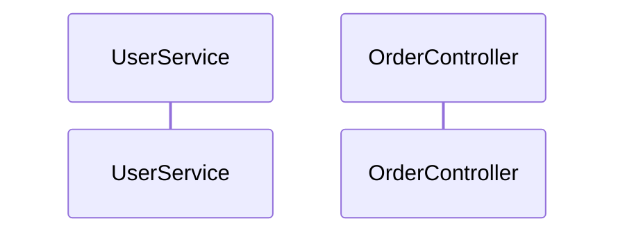

# Citation Rules for All Agents

## Universal Citation Types

### 1. REF-XXXXX: Code Location References (ALL AGENTS)
- **Format**: `REF-00001` onwards
- **Usage**: Reference specific code locations, files, classes, methods
- **Example**: "The `UserService` class [REF-00001] handles authentication"
- **Required by**: ALL agents

### 2. Agent-Specific Citations

#### Business Logic Analyst
- **BR-XXXXX**: Deterministic business rules (e.g., BR-00001 to BR-00039)
- **BR-LLM-XXXXX**: LLM-discovered business rules with confidence levels

#### Security Analyst
- **SEC-XXX**: Security vulnerabilities and findings
- **OWASP-XXX**: OWASP Top 10 mapping references
- **CVE-XXXX-XXXXX**: Known CVE references if applicable

#### Performance Analyst
- **PERF-XXX**: Performance bottlenecks and issues
- **OPT-XXX**: Optimization opportunities

#### Integration Specialist
- **INT-XXX**: Integration points and APIs
- **MSG-XXX**: Message/event patterns
- **EIP-XXX**: Enterprise Integration Pattern references

#### UI Analyst
- **UI-XXX**: UI component references
- **UX-XXX**: User experience issues

#### Technical/Solution Architect
- **ARCH-XXX**: Architectural patterns and decisions
- **COMP-XXX**: Component references
- **TECH-XXX**: Technology stack items

## Reference ID System (Universal)

Use reference IDs to keep documentation clean while maintaining complete traceability.

### Reference ID Format

**In Documentation**: `ComponentName` [REF-XXXXX]
- Example: "The `UserService` class [REF-00001] handles authentication"

**In Diagrams**: Add citation comments after diagram declaration
```mermaid
classDiagram
    %% Component Citations
    %% UserService: REF-00001 (src/main/java/UserService.java:45)
    %% OrderRepository: REF-00002 (src/main/java/OrderRepository.java:23)
```

### Using Citation Manager

```python
# Import citation tools
from framework.scripts.citation_manager import CitationManager
from framework.scripts.repomix_parser import RepomixParser

# Initialize at agent start
citation_manager = CitationManager()
repomix_parser = RepomixParser()

# Find component and add citation
location = repomix_parser.find_component_in_repomix("UserService", "class")
if location:
    ref_id = citation_manager.add_citation(
        component="UserService",
        file_path=location['file'],
        original_line=location.get('original_line'),
        repomix_line=location['repomix_line'],
        code_snippet=repomix_parser.extract_code_snippet(location['repomix_line'])
    )

# Use in documentation
doc_text = f"The `UserService` [{ref_id}] handles authentication..."
```

## Legacy Inline Format (Still Supported)

**Standard Format**: `ComponentName` (filename:line_number)
- Example: "The `UserService` class (UserService.java:245) handles authentication"

**Note**: Inline citations can be automatically converted to reference IDs using:
```python
updated_content, count = citation_manager.update_document_with_references(content)
```

## Implementation Guidelines

### MANDATORY Output File
**ALL agents MUST produce**: `output/docs/citations.md`
- **AGENT CANNOT COMPLETE** without this file existing
- Must contain all REF-XXXXX references with full details
- Format specified below in "Citations File Format"

### Using Citations in Documentation
- Use [REF-XXXXX] format in all documentation
- Add `%% Component Citations` to all diagrams

### Citations File Format
The `output/docs/citations.md` file must follow this format:
```markdown
# Citations

## REF-00001: UserService
- Original file: `src/services/UserService.java:45`
- Repomix line: 2456
- Context: Main user authentication service
- Code snippet:
  ```java
  public class UserService {
      // ... snippet ...
  }
  ```

## REF-00002: OrderController
- Original file: `src/controllers/OrderController.java:123`
- Repomix line: 3421
- Context: REST API controller for order management
```

### Required for ALL Diagrams
**Every diagram MUST have minimal citation comments:**

**Note**: Keep diagram citations clean (just REF-XXXXX) for better readability

## Quality Checks

### Verification Checklist
```bash
# Check diagrams have citation comments
for diagram in output/diagrams/*.mmd; do
    if [ -f "$diagram" ]; then
        if ! grep -q "%% Component Citations" "$diagram"; then
            echo "❌ WARNING: $diagram missing citation comments"
        fi
    fi
done

# Check documentation uses [REF-XXXXX] format
if ! grep -q "\[REF-" output/docs/*.md 2>/dev/null; then
    echo "❌ WARNING: No [REF-XXXXX] citations found in documentation"
fi

echo "✅ Citation format check complete"
```

### Pre-Diagram Entity Verification

Before creating any diagram, MUST verify ALL entities exist:

1. **Search Repomix**: Check compressed summary first
   ```bash
   Grep "class UserService" output/reports/repomix-summary.md
   ```

2. **Document Verification**:
   - ✅ Verified: `UserService` found at UserService.java:245
   - ❌ Not found: `PaymentGateway` not detected in codebase

3. **Fallback Search**: If not in Repomix, search raw codebase
   ```bash
   Grep "class UserService" codebase/
   ```

### Citation Requirements by Context

**Architecture Documentation**:
- Every component must cite source file
- Every relationship must reference actual imports/dependencies
- Every API endpoint must cite controller method

**Business Logic**:
- Every business rule must cite implementation
- Every validation must reference actual code
- Every workflow must cite orchestration logic

**Performance Analysis**:
- Every bottleneck must cite specific method/query
- Every optimization must reference current implementation
- Every metric must cite measurement source

**Security Findings**:
- Every vulnerability must cite exact location
- Every authentication flow must reference implementation
- Every encryption usage must cite specific code

### What Requires Citation

**MUST Cite**:
- Class/interface names
- Method/function names
- Database tables/entities
- API endpoints
- Configuration values
- Business rules
- Security implementations
- Performance bottlenecks

**No Citation Needed**:
- General observations
- Standard patterns (e.g., "uses MVC")
- Framework features (e.g., "Spring Boot application")
- Generic recommendations

### Handling Missing Information

When data cannot be found:
- State explicitly: "Not detected in codebase"
- Never fabricate or guess locations
- Document search performed: "Searched for X, not found"
- Suggest manual verification if critical

### Examples

**Good Citations**:
```markdown
The authentication flow begins in `LoginController` (LoginController.java:45) which
calls `AuthService.authenticate()` (AuthService.java:123). User credentials are
validated against the `users` table (User.java:15) using BCrypt hashing
(SecurityConfig.java:89).
```

**Bad Citations** (no source):
```markdown
The authentication flow uses a standard login controller that validates
credentials against the database using encrypted passwords.
```

## Verification Commands

Always verify before documenting:
```bash
# Verify class exists
Grep "class ClassName" output/reports/repomix-summary.md

# Verify method exists
Grep "methodName" output/reports/repomix-summary.md

# Verify import/dependency
Grep "import.*ClassName" output/reports/repomix-summary.md
```