# Diagram Validation Rules - Component Existence Verification

## 🚨 MANDATORY: Every Diagram Component Must Exist in Code

**CRITICAL**: No diagram can be created without verifying EVERY component exists in the actual codebase.

## Pre-Diagram Verification Workflow

### Step 1: Component Extraction
Before creating ANY diagram, extract all components that will appear:
```python
planned_components = [
    "UserController",
    "AuthService",
    "UserRepository",
    "SecurityConfig"
]
```

### Step 2: Existence Verification
For EACH component, verify it exists in codebase:
```bash
# Primary: Check Repomix summary
Grep "class UserController" output/reports/repomix-summary.md
Grep "interface UserController" output/reports/repomix-summary.md
Grep "function UserController" output/reports/repomix-summary.md

# If not found in Repomix, check raw codebase
Grep "class UserController" codebase/

# Document verification result
✅ UserController: Found at src/controllers/UserController.java:45
❌ PaymentGateway: Not found in codebase
```

### Step 3: Verification Documentation
Create verification log BEFORE diagram:
```markdown
## Component Verification for C4 Container Diagram

### Verified Components:
- ✅ `UserService` (UserService.java:15) - Main user management service
- ✅ `AuthController` (AuthController.java:23) - Authentication endpoint
- ✅ `PostgresDB` (application.yml:45) - Database configuration found
- ✅ `RedisCache` (CacheConfig.java:12) - Cache configuration

### Not Found (Excluded from Diagram):
- ❌ `PaymentService` - No payment-related code found
- ❌ `EmailGateway` - No email service detected
```

## Diagram Component Rules

### MANDATORY: Citation Comments for ALL Diagram Types

**See**: `framework/templates/CITATION_RULES.md` for complete citation requirements

**Key requirement**: Every diagram MUST include citation comments using `%% Component Citations` format.

### 1. Class/Component Diagrams - ACTUAL CLASS REQUIREMENTS

**🔴 MANDATORY: Class diagrams MUST show ACTUAL classes, methods, and relationships from code**

#### Before Creating ANY Class Diagram:

1. **VERIFY each class exists** in codebase
2. **LIST actual methods** from class definition
3. **CHECK actual inheritance** relationships
4. **TRACE real dependencies** via imports/injections

#### ❌ FORBIDDEN - Assumed Class Structure:
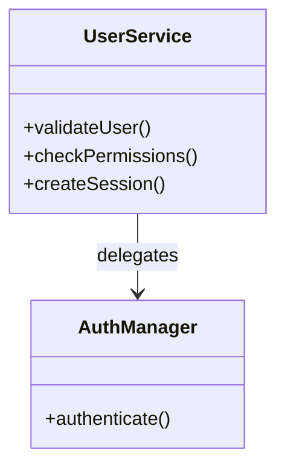

#### ✅ REQUIRED - Actual Class Structure:
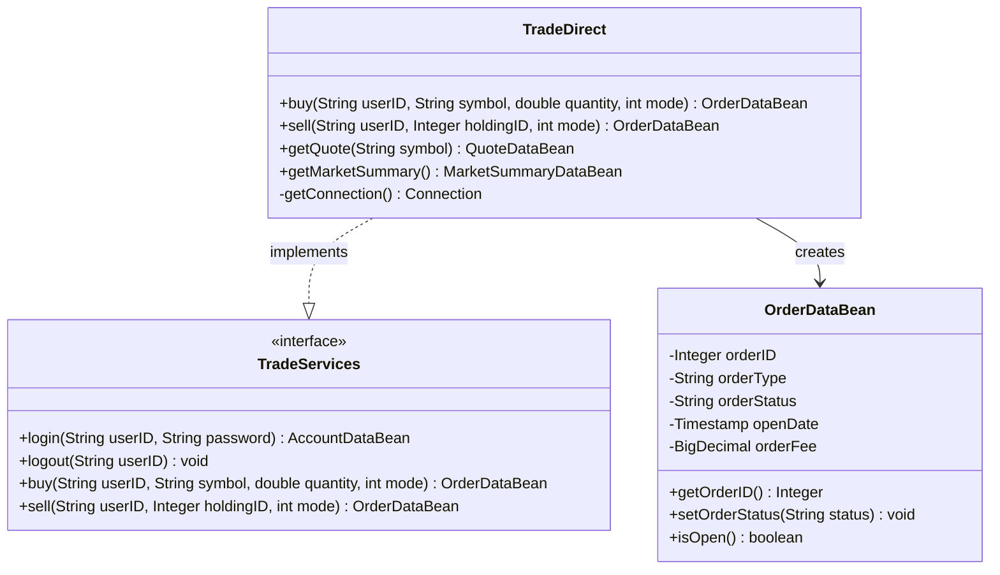

### 2. Sequence Diagrams - CRITICAL ACCURACY REQUIREMENTS

**🔴 MANDATORY: Sequence diagrams MUST show ACTUAL method calls from code, NOT conceptual flows**

#### Before Creating ANY Sequence Diagram:

1. **READ the actual method implementation**
2. **TRACE every real method call**
3. **USE exact method names and parameters**
4. **NEVER invent or assume method calls**

#### ❌ FORBIDDEN - Conceptual/Made-up Flows:
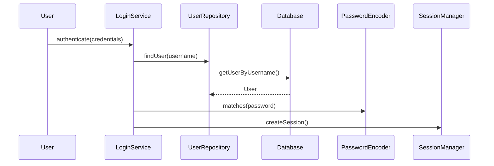

#### ✅ REQUIRED - Actual Code Tracing:
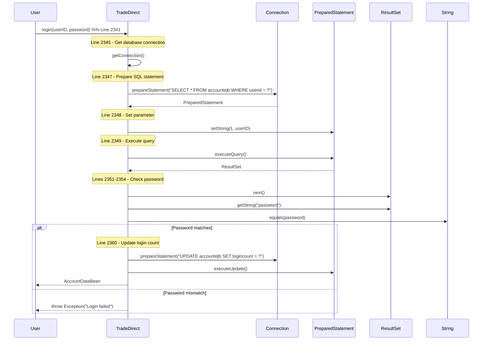

#### Verification Process for Sequence Diagrams:

```bash
# 1. Find the method implementation
grep -A 100 "public.*login" output/reports/repomix-summary.md

# 2. Extract ALL method calls from the implementation
# Look for patterns like:
#   - methodName(
#   - object.method(
#   - ClassName.staticMethod(
#   - new ClassName(

# 3. Document each call with line number
# Line 2345: getConnection()
# Line 2347: prepareStatement(sql)
# Line 2349: executeQuery()

# 4. Build diagram with ONLY these verified calls
```

### 3. C4 Architecture Diagrams
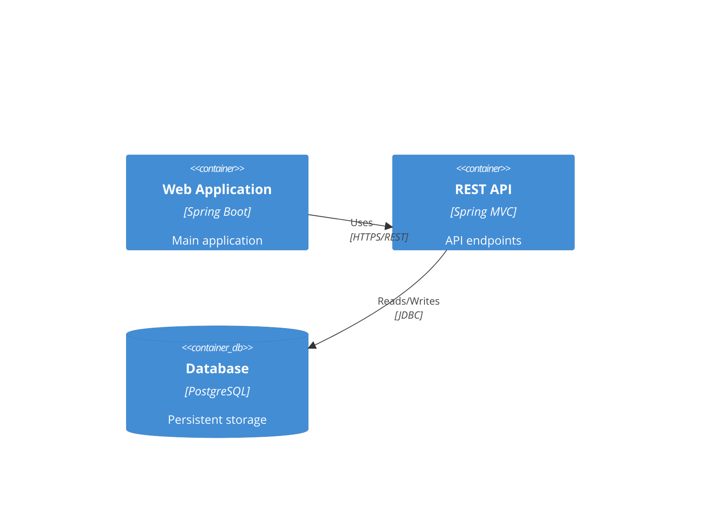

### 4. Flowchart/Graph Diagrams - CODE ACCURACY REQUIREMENTS

**🔴 MANDATORY: Flowcharts MUST represent ACTUAL code logic, not theoretical flows**

#### Before Creating ANY Flowchart:

1. **FIND the actual code logic** (if/else, switch, try/catch)
2. **USE actual condition checks** from code
3. **MATCH decision points** to real code branches
4. **NEVER create idealized flows**

#### ❌ FORBIDDEN - Theoretical/Idealized Flow:
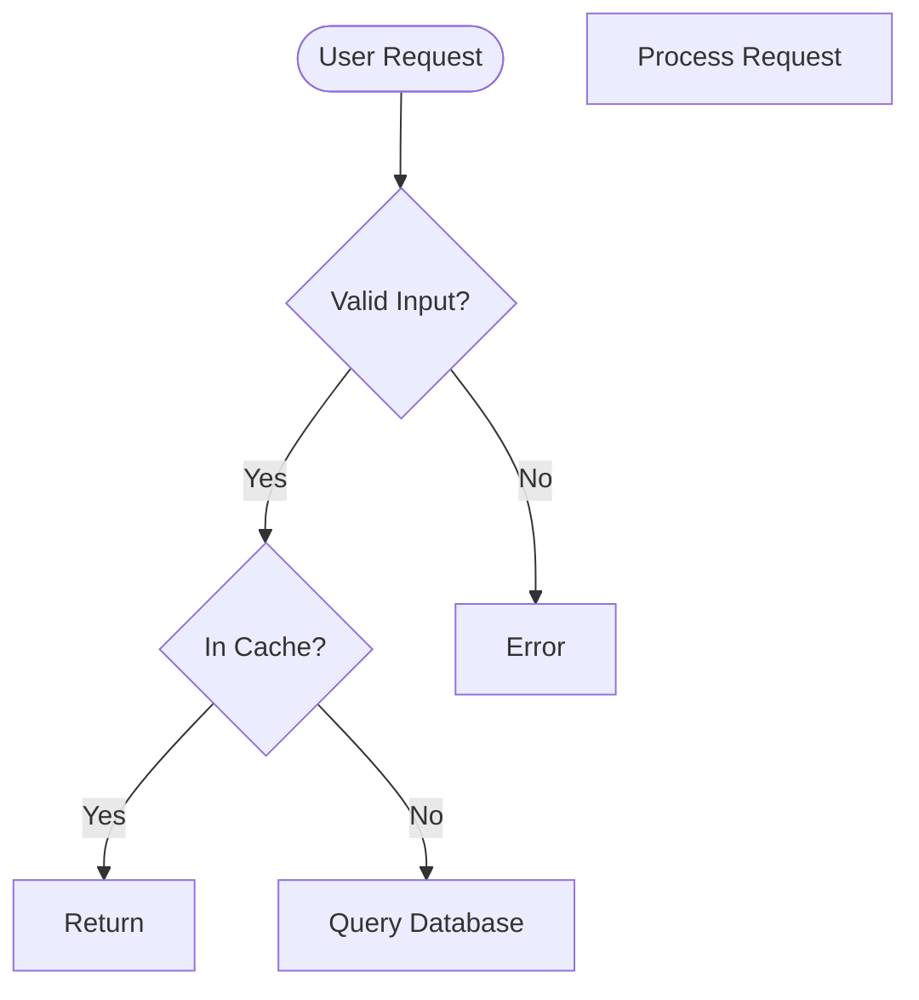

#### ✅ REQUIRED - Actual Code Logic:
```mermaid
flowchart TD
    %% Component Citations - Every decision from actual code
    %% TradeDirect.buy(): REF-00010 (line 834)
    %% Balance check: REF-00011 (line 856)
    %% Quote validation: REF-00012 (line 848)

    Start([buy() method called - Line 834])

    GetQuote[getQuote(symbol) - Line 848]
    QuoteNull{quote == null? - Line 850}

    CheckBalance{account.getBalance().compareTo(total) < 0 - Line 856}

    UpdateBalance[account.setBalance(account.getBalance().subtract(total)) - Line 862]
    CreateOrder[new OrderDataBean() - Line 868]
    SaveOrder[entityManager.persist(order) - Line 875]

    Start --> GetQuote
    GetQuote --> QuoteNull
    QuoteNull -->|Yes| ThrowException1[throw NotFoundException - Line 851]
    QuoteNull -->|No| CheckBalance
    CheckBalance -->|Yes| ThrowException2[throw InsufficientFundsException - Line 857]
    CheckBalance -->|No| UpdateBalance
    UpdateBalance --> CreateOrder
    CreateOrder --> SaveOrder
```

### 5. State Diagrams - ACTUAL STATE REQUIREMENTS

**🔴 MANDATORY: State diagrams MUST represent ACTUAL states and transitions from code**

#### Before Creating ANY State Diagram:

1. **FIND actual state fields/enums** in code
2. **VERIFY state transition methods** exist
3. **USE exact state values** from code
4. **MAP actual state change logic**

#### ❌ FORBIDDEN - Assumed State Machine:
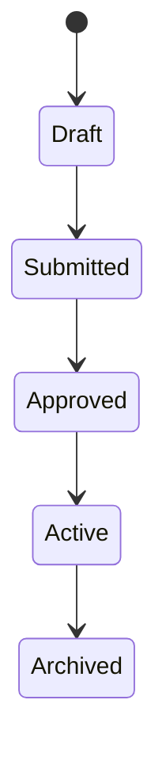

#### ✅ REQUIRED - Actual States from Code:
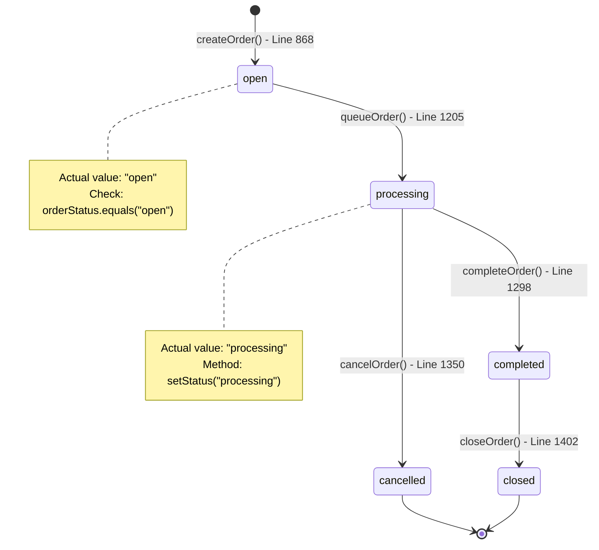

### 6. Entity Relationship Diagrams - DATABASE SCHEMA REQUIREMENTS

**🔴 MANDATORY: ER diagrams MUST represent ACTUAL database tables and relationships**

#### Before Creating ANY ER Diagram:

1. **FIND actual entity classes** (@Entity, @Table annotations)
2. **VERIFY table names** in code or SQL scripts
3. **CHECK actual foreign keys** (@ManyToOne, @JoinColumn)
4. **USE real column names** from entity definitions

#### ❌ FORBIDDEN - Assumed Schema:
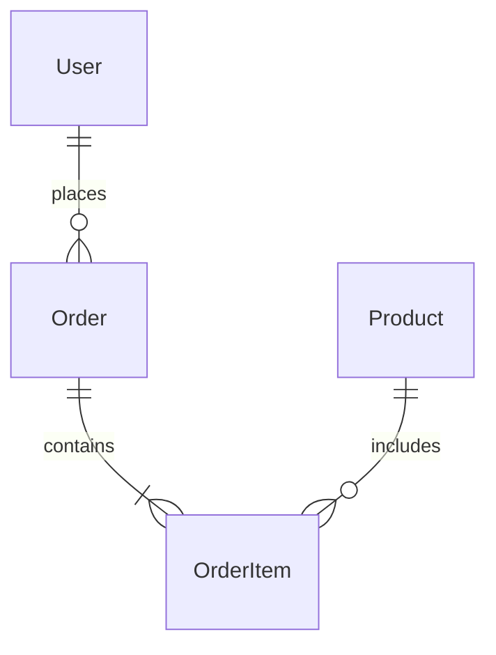

#### ✅ REQUIRED - Actual Database Schema:
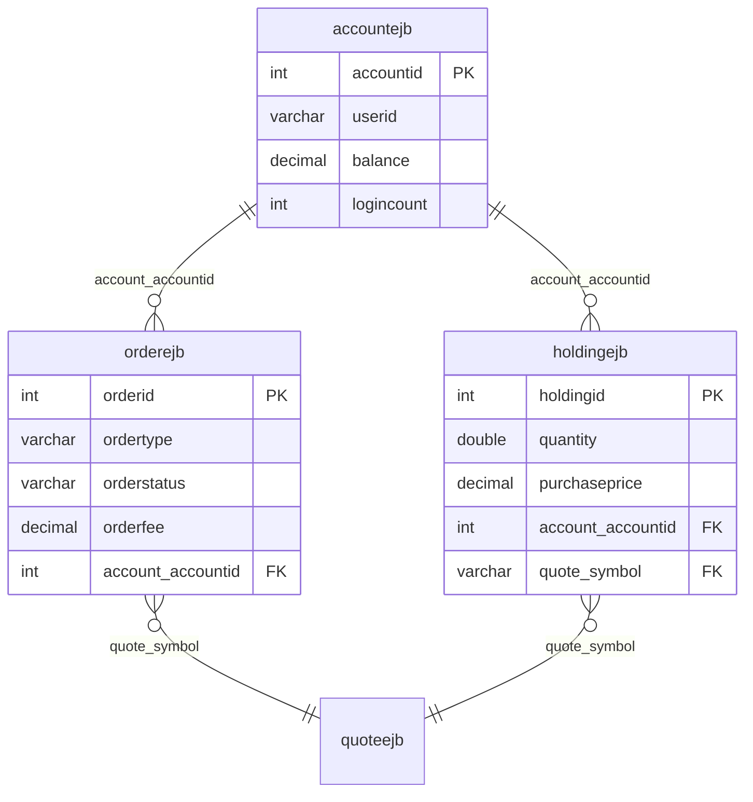

### 7. Gantt Charts (if used for project timelines)
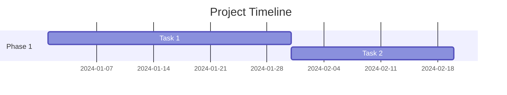

### 8. Embedded Diagrams in Markdown Files

**SAME RULES APPLY** for diagrams embedded in .md files:

````markdown
## System Architecture

The system uses a microservices architecture:

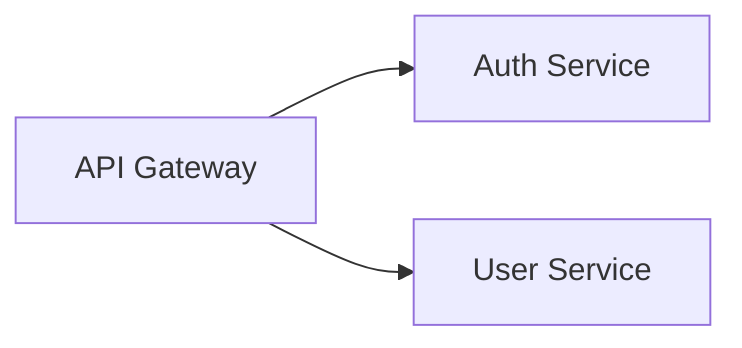
````

## Citation Format for Diagrams

**See**: `framework/templates/CITATION_RULES.md` for complete citation format and requirements

### Quick Reference for Diagrams:
- Use `%% Component Citations` comment block
- Format: `%% ComponentName: REF-XXXXX`
- Keep citations minimal in diagrams
- Full details go in `output/docs/citations.md`

## Verification Commands

### Quick Component Check
```bash
# Check if a class exists
Grep "class ComponentName" output/reports/repomix-summary.md

# Check if an interface exists
Grep "interface ComponentName" output/reports/repomix-summary.md

# Check if a function/method exists
Grep "function methodName\|def methodName\|public.*methodName" output/reports/repomix-summary.md

# Check if a database table exists (JPA/Hibernate)
Grep "@Entity.*TableName\|@Table.*table_name" output/reports/repomix-summary.md

# Check if an API endpoint exists
Grep "@GetMapping.*endpoint\|@PostMapping.*endpoint\|@RequestMapping.*endpoint" output/reports/repomix-summary.md

# Check configuration values
Grep "property.name\|CONFIG_KEY" output/reports/repomix-summary.md
```

## Handling Missing Components

### When Component Not Found:
1. **DO NOT** include it in diagram
2. **DO NOT** create placeholder or example component
3. **DO** document it as "Not detected"
4. **DO** note if it might be external/third-party

### Documentation Template:
```markdown
## Architecture Components Status

### Included in Diagrams:
- UserService (verified: UserService.java:12)
- OrderProcessor (verified: OrderProcessor.java:45)
- Database (verified: schema.sql, application.yml:23)

### Not Included (Not Found):
- MessageQueue: No messaging implementation detected
- CacheLayer: No caching code found
- PaymentGateway: May be external service (not in codebase)

### Assumptions Made:
- Database type inferred from PostgreSQL driver dependency
- REST API assumed from Spring Web dependency
```

## Validation Checklist

Before finalizing ANY diagram, confirm:

- [ ] Every component name extracted from diagram
- [ ] Each component searched in Repomix summary
- [ ] Fallback search in raw codebase for unfound items
- [ ] Verification status documented
- [ ] Only verified components included
- [ ] Source locations added as comments
- [ ] Missing components listed separately
- [ ] No fabricated/example components used

## Special Cases

### External Systems
If diagram needs external systems (not in codebase):
- Mark clearly as "External System"
- Note why it's assumed to exist
- Reference any configuration that mentions it

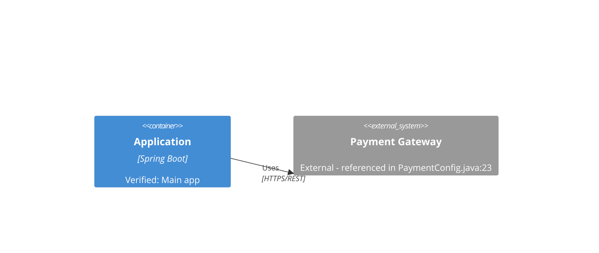

### Configuration-Based Components
For components defined in configuration:
- Verify configuration file exists
- Extract actual values from config
- Reference config location

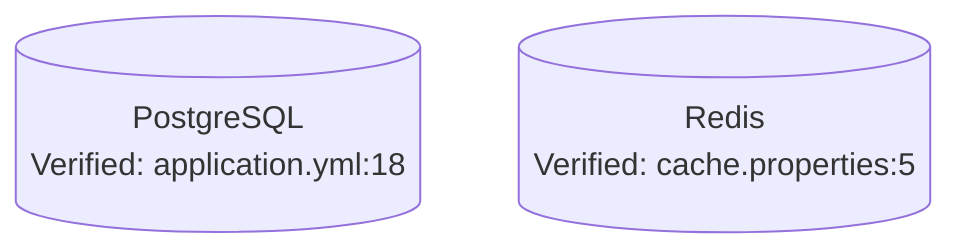

## Enforcement

**Agents MUST:**
1. Run verification BEFORE creating diagrams
2. Include verification comments in diagram source
3. Document unfound components separately
4. Never complete if diagrams contain unverified components

**Validation Script Integration:**
```python
def validate_diagram_components(diagram_content, repomix_content):
    """
    Extract all component names from diagram
    Verify each exists in repomix summary
    Return validation report
    """
    components = extract_components_from_diagram(diagram_content)
    verification_results = {}

    for component in components:
        found = search_in_repomix(component, repomix_content)
        verification_results[component] = {
            'found': found,
            'location': get_source_location(component) if found else None
        }

    return verification_results
```

## Agent Validation Process

### When Agents Should Validate

1. **AFTER** all diagram files are written to disk
2. **BEFORE** agent completion
3. **NOT** during diagram planning or creation

### How Agents Should Handle Validation

```python
# After writing all diagrams
Write("output/diagrams/my-diagram.mmd", diagram_content)

# Then validate
result = Bash("python3 framework/scripts/simple_mermaid_validator.py output/diagrams/")

# Check exit code, not output text
if result.returncode == 0:
    print("✅ All diagrams valid - proceeding to completion")
    # Note: "✅ Valid" messages in output are SUCCESS indicators
else:
    print("❌ Validation failed - fixing errors")
    # Read the specific error
    # Fix ONLY that issue
    # Re-validate
    # Continue (do NOT restart agent)
```

### Critical Points for Agents

- **Exit Code 0 = Success** even if you see "✅ Valid" or other output
- **Exit Code 1 = Failure** requiring fixes
- **Fix and Continue** - Never restart the agent for validation issues
- **Success Messages Are Not Errors** - "✅ Valid" means the diagram is correct

## Universal Diagram Accuracy Rules

### The Golden Rule for ALL Diagram Types
**If you cannot point to the EXACT line of code where something exists, it does NOT belong in ANY diagram.**

### Diagram Type Specific Requirements:

#### 📊 Class Diagrams
- **MUST** show actual class names from code
- **MUST** list only methods that exist (with exact signatures)
- **MUST** show real inheritance/implementation relationships
- **MUST** use actual field types and visibility modifiers

#### 📈 Sequence Diagrams
- **MUST** trace actual method calls line by line
- **MUST** show real parameters and return values
- **MUST** include actual SQL queries, not abstractions
- **MUST** show real exception handling paths

#### 🔄 State Diagrams
- **MUST** use actual state values from code (enums, constants)
- **MUST** show only state transitions that have methods
- **MUST** match state checks exactly (e.g., `status.equals("open")`)
- **MUST** cite the state field/enum definition

#### 🔀 Flowcharts
- **MUST** match actual if/else/switch conditions
- **MUST** use exact comparison operators from code
- **MUST** show real exception paths
- **MUST** follow actual code execution order

#### 🗄️ ER Diagrams
- **MUST** use actual table names from @Table annotations or SQL
- **MUST** show real column names and types
- **MUST** represent actual foreign key relationships
- **MUST** match database schema exactly

#### 🏗️ Architecture Diagrams (C4)
- **MUST** only include systems/services that exist
- **MUST** verify via configuration files or deployment scripts
- **MUST** use actual technology names from dependencies
- **MUST** show real integration points

### Common Mistakes to AVOID Across ALL Diagrams:
1. **Conceptual representations** - "This is how it should work"
2. **Best practice patterns** - "This is the standard way"
3. **Simplified views** - "This is easier to understand"
4. **Missing complexity** - "This part is too detailed"
5. **Assumed components** - "There must be a cache here"

### What MUST Be Included in ALL Diagrams:
1. **Line number references** - Where each element is defined
2. **Exact naming** - No paraphrasing or simplification
3. **Complete paths** - All steps, even if complex
4. **Actual data types** - Not generic types
5. **Real configurations** - From actual config files

## Result: Zero Hallucinated Components

By following these rules:
- ✅ Every diagram component traces to actual code
- ✅ Every sequence diagram shows REAL method calls with line numbers
- ✅ No invented architectures or conceptual flows
- ✅ Clear documentation of what exists vs. what doesn't
- ✅ Reliable, trustworthy technical diagrams
- ✅ Audit trail for every architectural decision
- ✅ Proper validation without false positives