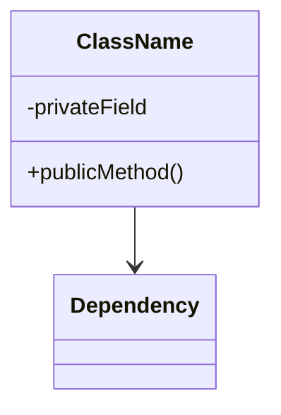
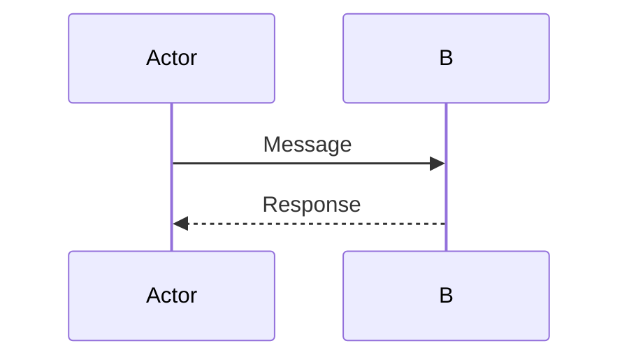
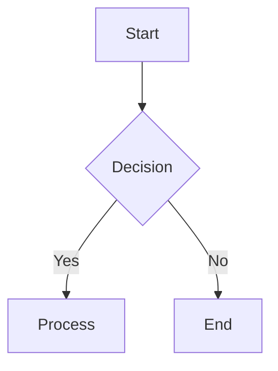
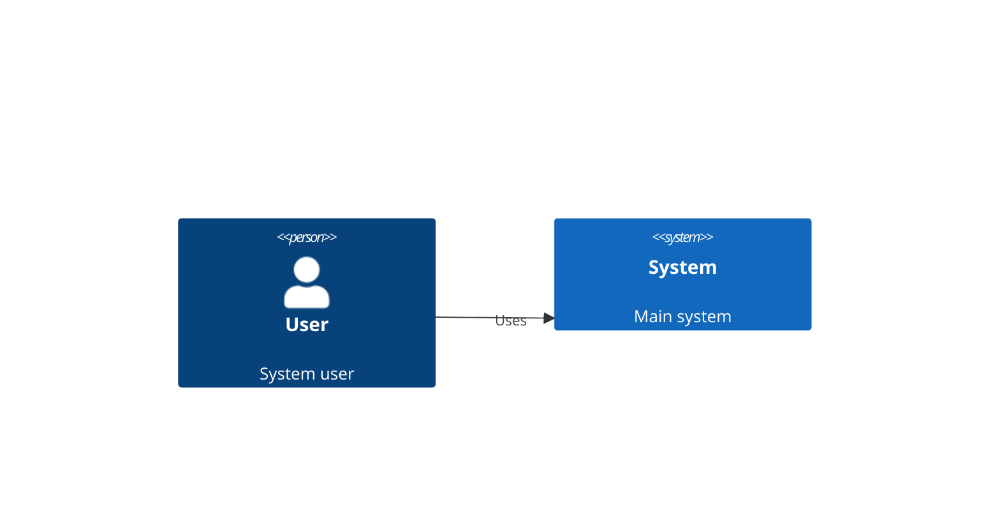

# Mermaid Diagram Rules

## Mandatory Validation

ALL Mermaid diagrams MUST compile without errors:

### When to Validate
- **AFTER** writing diagram files to disk
- **NOT** during diagram creation or planning
- **BEFORE** agent completion

### How to Validate
```bash
# Validate all diagrams in output directory
python3 framework/scripts/simple_mermaid_validator.py output/diagrams/

# Check exit code (NOT the output text)
if [ $? -eq 0 ]; then
    echo "Validation passed - diagrams are valid"
else
    echo "Validation failed - fix errors and re-validate"
fi
```

### Understanding Validation Output
- **Exit code 0** = SUCCESS (even if you see "✅ Valid" messages)
- **Exit code 1** = ERRORS that need fixing
- **Success messages** like "✅ Valid" are NOT errors
- **Only actual syntax errors** require fixes

### If Validation Fails
1. Read the specific error message
2. Fix ONLY the identified issue
3. Re-validate the corrected file
4. Continue with your tasks (do NOT restart)

## Common Issues to Avoid

1. **Special Characters**: Escape or avoid characters that break Mermaid
   - Use quotes for labels with spaces: `["User Service"]`
   - Avoid: `<>{}[]|&` in labels unless properly escaped
   - Use underscores instead of spaces in IDs: `user_service` not `user service`

2. **Syntax Rules**:
   - End statements with proper delimiters
   - Use correct arrow syntax: `-->`, `-.->`, `==>`
   - Ensure matching brackets and quotes
   - No trailing commas in sequences

3. **Entity Verification**:
   - Verify ALL entities exist before adding to diagrams
   - Use actual component names from codebase
   - Never use placeholder or example names

## Diagram Types and Syntax

### Class Diagrams


### Sequence Diagrams


### Flow Charts


### C4 Diagrams


## Validation Workflow for Agents

### Complete Validation Process

1. **Create and Write Diagrams**
   - Design your diagrams
   - Add citation comments
   - Write to output/diagrams/ or embed in .md files

2. **Validate AFTER Writing**
   ```bash
   # For standalone diagrams
   python3 framework/scripts/simple_mermaid_validator.py output/diagrams/

   # For embedded diagrams in documentation
   python3 framework/scripts/simple_mermaid_validator.py output/docs/

   # Store exit code for checking
   VALIDATION_RESULT=$?
   ```

3. **Interpret Results Correctly**
   ```bash
   if [ $VALIDATION_RESULT -eq 0 ]; then
       # SUCCESS - Diagrams are valid
       # "✅ Valid" messages are SUCCESS indicators, NOT errors
       echo "All diagrams validated successfully - proceed to completion"
   else
       # FAILURE - Actual syntax errors found
       echo "Syntax errors detected - fix and re-validate"
       # Read specific error messages
       # Fix ONLY the identified issues
       # Re-run validation
       # Continue agent tasks (do NOT restart agent)
   fi
   ```

4. **Common Misunderstandings**
   - ✅ **"Valid" messages are NOT errors** - they indicate success
   - ❌ **Red text in terminal is NOT always an error** - check exit code
   - 🔄 **Do NOT restart agent on validation failure** - fix and continue
   - ⏱️ **Validate AFTER writing files** - not during creation

### Quick Reference
- **Exit Code 0** = All diagrams valid (may show success messages)
- **Exit Code 1** = Syntax errors need fixing
- **Fix and Continue** = Never restart agent for diagram issues

## Error Resolution

If validation fails:
1. Read the specific error message
2. Check line numbers mentioned
3. Fix syntax issues
4. Re-run validation
5. Repeat until zero errors